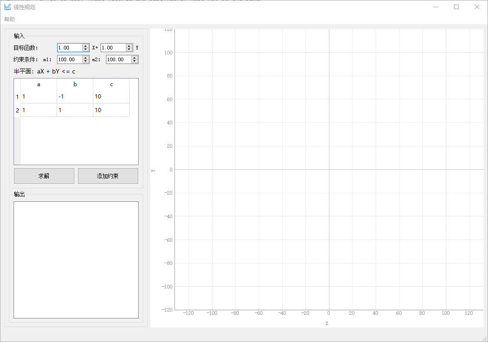
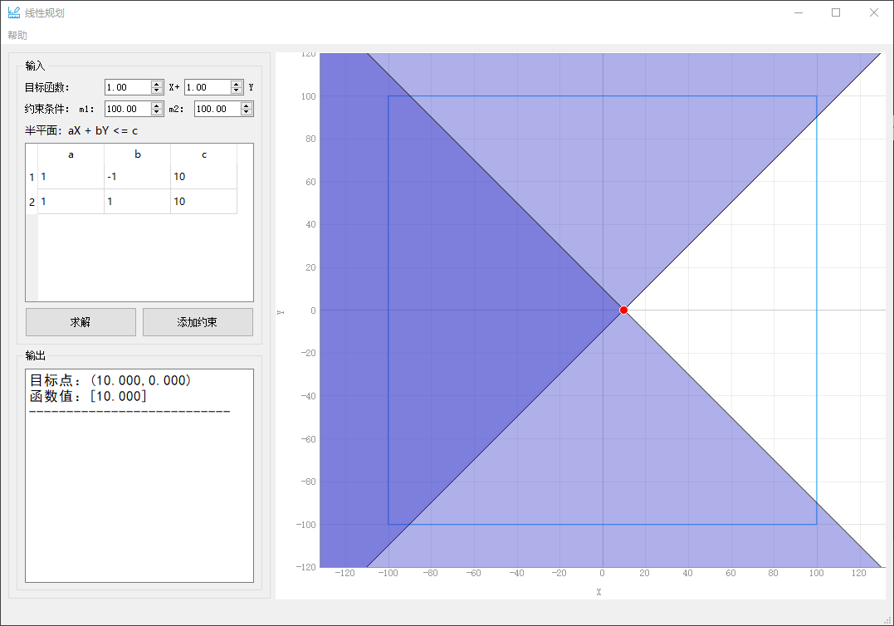
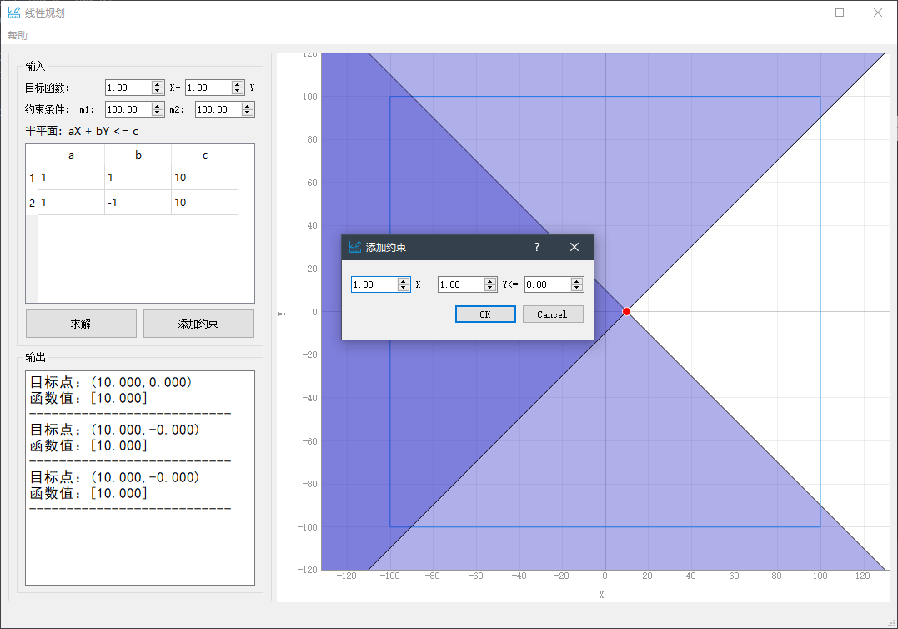
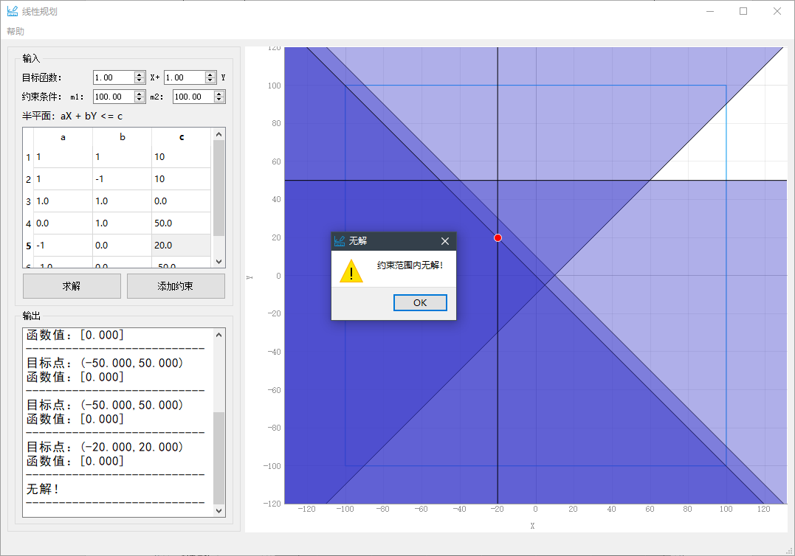
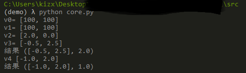

# 递增式线性规划
## 说明
运行可执行程序后会出现一个命令行窗口和程序主界面如下，为了显示可能的报错，本程序打包时未隐藏命令行窗口，请勿关闭该窗口。



程序默认目标函数为`X+Y`,`X`和`Y`的约束范围均为-100~100，可以自行修改该信息，输入范围本程序限制在了-1000 ~ 1000内。程序默认添加了两个半平面约束条件，可以自行寻改参数或者点击`添加约束`按钮添加约束。点击`求解`按钮后获得如下图输出，求解功能是将表格中的所有约束条件都进行一遍计算并得出最终结果。任何情况下更改了目标函数或者约束条件，都可以通过点击求解按钮重新计算结果。

右半边的示意图是基于`pyqtgraph`库绘制的，鼠标左键可以移动画面，滚轮可以缩放画面。蓝色的方框表示边界约束，紫色的区域表示半平面，颜色叠加的深色区域表示可行解域，红色点表示使目标函数最大的点，左下角也会显示输出结果。



此时点击`添加约束`,会弹出添加约束的窗口，可以根据需要添加约束，点击`OK`后程序会自动动态递增式更新结果，无需点击求解，如果点击求解则会从头计算一遍。



本程序的亮点是不仅可以处理约束半平面直线平行的情况，还可以处理半平面直线为水平或者垂直的情况，当半平面为垂直线时，程序判断可行解范围时将无法对X的范围进行搜索，因此转而对Y的范围进行搜索。如下图所示，输入水平线和垂直线约束条件后程序可以正确计算输出，需要注意的是由于所采用的绘图库的限制，画垂直线约束时无法对半平面进行紫色着色。


当约束条件无解时会弹出警告框提示当前情况下无解。



### 运行源码

若二进制文件运行失败或者有需要，可以参考以下命令搭建Python虚拟环境运行源码：

```cmd
cd .\src
python -m venv venv
cd .\venv\Scripts
activate
cd ..
cd ..
python -m pip install --upgrade pip
pip install -r requirements.txt
```

然后输入`python core.py`运行核心代码，输出如下图结果，该结果表示依次添加半平面约束后输出的目标点。



该程序的输入可以在`core.py`中最后几行查看和修改，也可以调用`add()`方法动态添加约束。

```python
if __name__ == '__main__':
    _ObjFun = [1, 1]  # 目标函数 默认为x+y
    _limts = [100, 100]  # 边界约束
    _HalfPlanes = [[1, -1, 2], [1, 1, 2], [1, -1, -3]]  # 半平面约束条件
    test = LinearProgram(_ObjFun, _limts, _HalfPlanes)
    myresult = test.main()
    print('结果', myresult)
    myresult = test.add([1, 2, 3])  # 动态添加约束
    print('结果', myresult)
```

如果环境安装无误的话，可以输入`python main.py`运行交互式界面（报错可能性大，建议用Pycharm运行）。